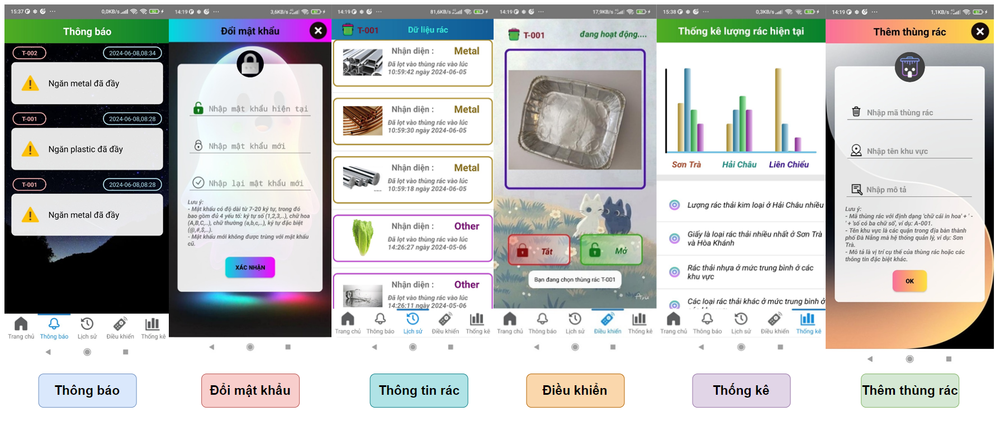

# Smart Trash Project 🚮✨  
## Table of Contents
- [Demo](#demo)
- [Team Roles](#team-roles)
- [Description](#description)
- [Design System](#design-system)
- [Installation Guide](#installation-guide)
- [Contributing](#contributing)
- [Contact](#contact)
## Demo 🎥

## Team Roles
- **Mr. Hoang Trong** - AI Engineer
  - Responsibilities: Researched algorithm for model training, collected data, trained and fine-tuned AI model, developed Django Rest Framework server, implemented APIs for mobile deployment, and wrote reports.
  - Github: [https://github.com/bigboss151102](https://github.com/bigboss151102)

- **Mr. Do Cuong** - IOT Engineer
  - Responsibilities: Collected real data captured from ESP32 CAM, established connection protocol between ESP32 CAM and Server, set up Websockets for communication between ESP8266 and Server, processed information upon receiving waste data, deployed Backend Server via NGROK and Websockets via AWS.
  - Github: [https://github.com/cuongdc03](https://github.com/cuongdc03)

- **Mr. Tran Thinh** - Sofware Engineer
  - Responsibilities: Developing a mobile application using Android Kotlin to integrate and deploy the entire system's functions on a smart and user-friendly interface, interacting with APIs from the server. Additionally, it supports hardware installation and development, data collection, project result reporting, and in-depth analysis.
  - Github: [https://github.com/tttiuem2k3](https://github.com/ttttiuem2k3)

- **Mr. Vu Tin** - Hardware Engineer
  - Responsibilities: Design hardware model, assemble circuit, write servo control code, and compile a report.
  - Github: [https://github.com/hoanggtin](https://github.com/hoanggtin)

## Description
### 1. Design and Build of Smart Trash Bins:
- We have designed and constructed smart trash bins that are compact and suitable for various public settings such as schools, parks, residential areas, and commercial zones.
- These bins are partitioned into multiple compartments to accommodate different types of waste, including paper, plastic, and metal.

### 2. Integration of Camera and Image Processing System:
- Each trash bin is equipped with an internal camera to capture images of deposited waste.
- The images are transmitted to a server for processing, facilitating real-time analysis of waste content.

### 3.AI Model Application for Waste Classification:
- Utilizing advanced AI technology, our server deploys models to analyze and categorize waste based on the images received from ESP32 cameras.
- This automated classification system enhances efficiency in waste management processes.

### 4. Mechanism for Compartment Rotation:
- Our smart bins feature a mechanical system that rotates compartments according to the waste type identified by the AI model.
- This ensures precise segregation and facilitates easier waste collection and recycling.

### 5. Management and Monitoring via Server System:
- A centralized server manages and monitors the status of each trash bin in real-time.
- It provides an intuitive interface for administrators to track fill levels, optimize collection routes, and promptly respond to bin capacity.


## Design System
### 1. Model

### 2. IOT System

### 3. AI Flow

### 4. Mobile interface


## Installation Guide ⚙️
### Prerequisites
- Python 3.9+
- Android Studio (for mobile app)
- PlatformIO (for ESP32/ESP8266)
```cmd
pip install -r requirements.txt
```

## License 📜
This project is licensed under the [MIT License](https://opensource.org/licenses/MIT) - see the [LICENSE](LICENSE) file for details.

You are free to:
- Use the source code for personal or commercial purposes.
- Modify the source code.
- Distribute copies of the source code.

Under the following conditions:
- Include the original copyright notice and license in any copy of the project.
- State any changes made to the code.
- Include a disclaimer stating that the software is provided "as is", without warranty of any kind.

You are not required to:
- Provide the source code or changes back to the community.
- Share any modifications you make to the source code.

By contributing to this repository, you agree to license your contributions under the same terms.

For questions or inquiries about commercial licensing, please contact [tttiuem2k3@gmail.com].

## Contact
For questions, contributions, or bug reports, please feel free to reach out:

- Email: [tttiuem2k3@gmail.com](tttiuem2k3@gmail.com)
- Linkedin: [https://www.linkedin.com/in/thinh-tran-04122k3/](https://www.linkedin.com/in/thinh-tran-04122k3/)
- Zalo: +84 329966939
Let's build a cleaner future together! ♻️💡
