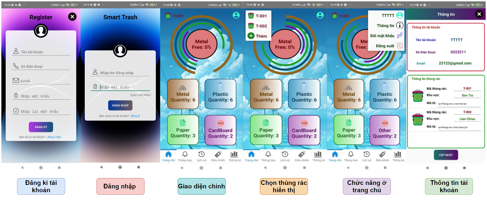

# Smart Trash Project 🚮✨

A cutting-edge project that integrates IoT, AI, and smart design to revolutionize waste management. Our Smart Trash Bins utilize advanced technology for real-time waste analysis, precise segregation, and efficient management.

---

## Table of Contents
- [🎥 Demo](##demo)
- [👥 Team Roles](#team-roles)
- [🧠 Description](#description)
- [🌟 Design System](#design-system)
- [⚙️ Installation Guide](#installation-guide)
- [🤝 Contributing](#contributing)
- [📬 Contact](#contact)

---

## Demo 🎥


---

## Team Roles 👥

### **Mr. Hoang Trong** - AI Engineer 🤖
- **Responsibilities:**
  - 🔍 Researched algorithms for model training.
  - 📊 Collected and processed data.
  - 🏋️‍♂️ Trained and fine-tuned AI models.
  - 🌐 Developed a Django REST Framework server.
  - 📱 Implemented APIs for mobile deployment.
  - 📝 Authored technical reports.
- **Github:** [bigboss151102](https://github.com/bigboss151102)

### **Mr. Do Cuong** - IoT Engineer 🌐
- **Responsibilities:**
  - 📸 Captured real-time data using ESP32 CAM.
  - 🔗 Established connection protocols between ESP32 CAM and the server.
  - 💬 Configured WebSockets for ESP8266-server communication.
  - 🛠️ Processed waste data for analysis.
  - 🚀 Deployed the backend server via NGROK and AWS.
- **Github:** [cuongdc03](https://github.com/cuongdc03)

### **Mr. Tran Thinh** - Software Engineer 💻
- **Responsibilities:**
  - 📱 Developed a mobile application using Android Kotlin.
  - 🔄 Integrated server APIs for seamless system functionality.
  - 🛠️ Supported hardware installation and system integration.
  - 📈 Collected and analyzed project data.
  - 📝 Reported project outcomes with in-depth analysis.
- **Github:** [tttiuem2k3](https://github.com/tttiuem2k3)

### **Mr. Vu Tin** - Hardware Engineer 🔧
- **Responsibilities:**
  - 🖥️ Designed hardware models.
  - 🔩 Assembled circuits.
  - 🤖 Programmed servo control systems.
  - 📝 Compiled comprehensive reports.
- **Github:** [hoanggtin](https://github.com/hoanggtin)

---

## Description 🧠

### 1. **Smart Trash Bin Design & Construction** 🏗️
- Engineered compact and versatile smart trash bins suitable for various public environments including schools, parks, residential areas, and commercial zones.
- Incorporated multiple compartments within each bin to effectively segregate different waste types such as paper, plastic, and metal.

### 2. **Integrated Camera & Image Processing System** 📸
- Equipped each bin with an internal camera to capture images of deposited waste.
- Transmitted images to a centralized server for real-time processing and analysis.

### 3. **AI-Powered Waste Classification** 🤖
- Deployed advanced AI models to analyze images received from ESP32 cameras.
- Automated waste classification to streamline waste management processes and enhance operational efficiency.

### 4. **Automated Compartment Rotation Mechanism** 🔄
- Implemented a mechanical system that rotates compartments based on the waste type identified by the AI model.
- Ensured accurate segregation to facilitate efficient waste collection and recycling.

### 5. **Centralized Management & Monitoring** 📊
- Utilized a robust server system to manage and monitor the status of each trash bin in real-time.
- Provided an intuitive interface for administrators to track fill levels, optimize collection routes, and respond promptly to capacity issues.

---

## Design System 🌟

### 1. **3D Model of Smart Trash Bin** 📐


### 2. **IoT System Architecture** 🔌


### 3. **AI Workflow Diagram** 🤖


### 4. **Mobile Interface Design** 📱



---

## Installation Guide ⚙️

### Prerequisites
- **Python:** Version 3.9+
- **Mobile Development:** Android Studio (for the mobile app)
- **IoT Development:** PlatformIO (for ESP32/ESP8266)

### Setup

```bash
pip install -r requirements.txt
```

## Contributing 🤝

We welcome contributions to enhance the Smart Trash Project! If you'd like to contribute, please follow these steps:

1. **Fork** this repository.
2. **Clone** the repository to your local machine.
3. Create a new **branch** for your feature or bug fix.
4. Commit your changes with clear and descriptive messages.
5. **Push** your changes and open a **Pull Request**.

For major changes, please open an issue first to discuss your ideas. By contributing to this repository, you agree to license your contributions under the same [MIT License](https://opensource.org/licenses/MIT).

---

## License 📜

This project is licensed under the [MIT License](https://opensource.org/licenses/MIT). Please see the [LICENSE](LICENSE) file for details.

**You are free to:**
- Use the source code for personal or commercial purposes.
- Modify and distribute the source code.
- Include the original license and disclaimers in your distributions.

**Conditions:**
- Clearly document any modifications you make to the source code.
- The source code is provided "as is", without any warranty of any kind.

---

## Contact 📬

If you have any questions, suggestions, or bug reports, please feel free to reach out:

- **Email:** [tttiuem2k3@gmail.com](mailto:tttiuem2k3@gmail.com)
- **LinkedIn:** [Thinh Tran](https://www.linkedin.com/in/thinh-tran-04122k3/)
- **Zalo:** +84 329966939

Let's work together to build a cleaner and smarter future! ♻️💡
